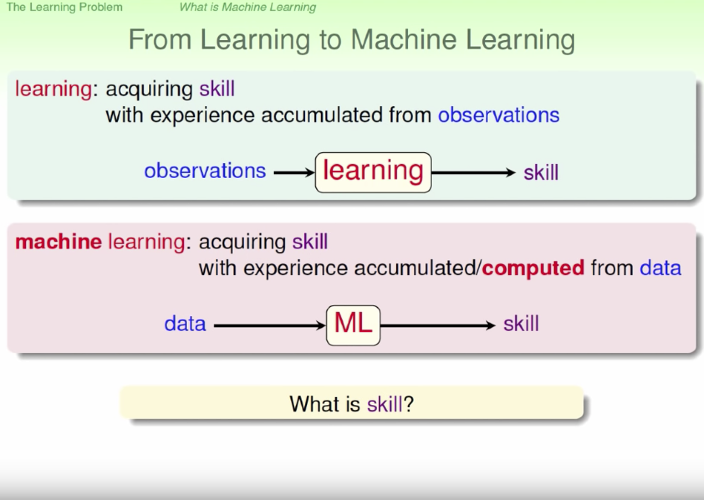

# 機器學習基石-林軒田

機器學習就是模仿人類觀測學習技能的過程

而機器透過從資料觀測學會在某個技能上有更好的表現

學到的技巧，及特定表現的增強

可能會用到機器學習的情況

- 短時間判斷
- 閱讀大量資訊得到結論
- 針對個人客製化
- 沒辦法將規則明確地寫下(樹怎麼用程式表示)
- 探索未知的規則

三個重要關鍵因素

- 有潛藏的模式或規則(如果很輕易的可以寫成規則也不需機器學習)
- 希望增強的目標
- 需要有資料

相關應用

- Netflix 影片推薦系統
- 穿搭推薦系統
- 音樂推薦系統(喜好)

我們會又客戶評價電影的分數，依客戶評價的電影類型反推顧客喜好

我們知道電影屬性在與顧客喜好矩陣將其內積，算出這個客戶可能會喜歡這部電影的分數，進行推薦

Ｄ為歷史資料

g為我們產生，想逼近實際f這個潛在模式（理想公式）

這個定義是這樣機器學習就是我們從資料出發 從資料出發以後機器學習演算法要算什麼，要算出一個假說，一個hypothesis，我們叫做g。 然後我們希望這個g要做什麼，這個g要很接近我們真正心裏最渴望的那個 f，這個f是用來產生資料，但是我們不知道那個東西。 所以這是機器學習的這個演算法。
